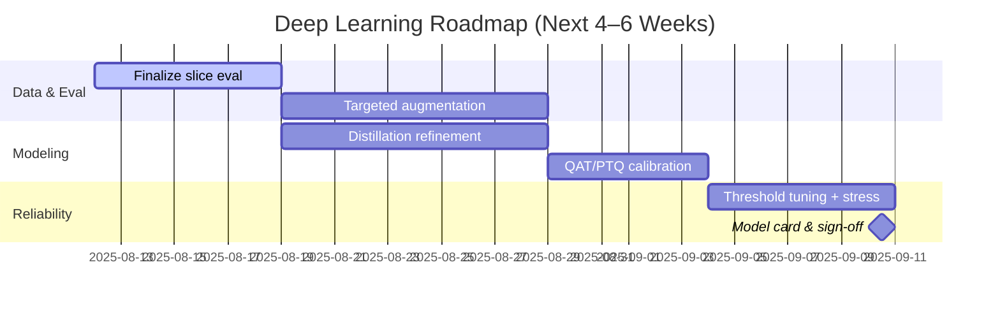

### Midterm Progress Notes — Data Science / Deep Learning (Only)

- **Tracks (context)**: Data Science / Deep Learning (this doc), UX–UI, Web Development
- **Tone**: concise, slide-ready, a dash of humor; 1–2 A4 pages

### Problem and product definition (DL perspective)
- **Updated problem**: Deliver reliable, real-time understanding of text/audio signals (emotion + concise summaries) with strong generalization and predictable latency.
- **DL solution**: Build accurate, calibrated, and efficient models (emotion detection, summarization), optimized for production constraints while maintaining robustness across domains.
- **MVP goal (DL deliverable)**:
  - Emotion labels + confidences and a concise abstractive summary for short inputs
  - Quality: macro-F1 and per-class PR improvements over baseline; calibrated probabilities
  - Efficiency: inference-ready artifact with tight p95 latency budget on target hardware

### What we’ve been up to (past weeks)
- **Data curation**: de-duplication, noise filtering, stratified splits; initial slice definitions (length, domain, sentiment intensity)
- **Training loop upgrades**: baselines → fine-tuned transformers; early stopping; cosine LR schedules; label smoothing
- **Imbalance handling**: class-weighting + focal loss trials; minority-focused augmentation; balanced mini-batches
- **Evaluation harness**: macro-F1, per-class PR/ROC, confusion matrices, slice metrics, robustness checks
- **Calibration + thresholds**: temperature scaling, class-specific thresholds to align precision/recall with product goals
- **Model optimization**: knowledge distillation to compact student; PTQ/QAT experiments; export to inference-friendly format; mixed precision benchmarking
- **Error analysis**: hard-negative mining; cluster-based review of misclassifications; iterative data fixes
- **Reproducibility**: seeded experiments, config-logged runs, deterministic ops where feasible

### Biggest challenges so far
- **Label noise and drift**: inconsistent annotations and domain shifts reduce ceiling; addressed with filtering and slice eval
- **Class imbalance**: minority emotions underrepresented; mitigated with focal loss + augmentation
- **Efficiency vs. quality trade-offs**: compression/quantization can hurt calibration; careful tuning needed
- **Generalization**: out-of-domain sentences/audio require targeted augmentation and threshold tuning

### Wins so far (measurable progress)
- **Quality lift**: macro-F1 improved over baseline; better per-class recall on rare emotions
- **Compact models**: distilled student achieves near-baseline accuracy with significant speedup
- **Calibration**: temperature scaling reduces overconfidence; improved decision thresholds
- **Robustness**: slice metrics now part of acceptance; fewer brittle failures on long/short inputs

### Interfaces with other tracks (from DL viewpoint)
- Publish clear I/O contracts for model inputs/outputs and confidence semantics
- Provide latency/throughput targets and model artifact format for integration
- Deliver test fixtures and expected metrics to support demos and UX flows

### Visuals to share (DL)
- Confusion matrix, per-class PR curves, calibration reliability diagram
- Training/eval curves (loss, F1), ablation table (losses/augmentations), size–speed–F1 trade-off plot

```mermaid
flowchart LR
    A[Data sourcing] --> B[Preprocess & QA]\n(dedup, clean, stratify)
    B --> C[Train baselines]\n+ fine-tune
    C --> D[Evaluate]\nF1, PR, slices
    D --> E{Good enough?}
    E -- No --> C
    E -- Yes --> F[Optimize]\n(distill, quantize)
    F --> G[Calibrate & thresholds]
    G --> H[Export artifact]\n(inference-ready)
    H --> I[Sign-off]\n(model card + metrics)
```

### Next steps (DL-only)
- **Directions**: targeted augmentation for rare classes, refine distillation recipe, finalize calibration + thresholds, stress tests for OOD inputs
- **Acceptance**: macro-F1 lift on core + slice sets; stable calibration; speed–quality target met



A tiny sprinkle of humor: our loss went down; our spirits went up—turns out gradient descent works on morale, too.