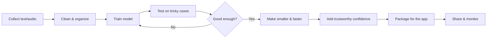
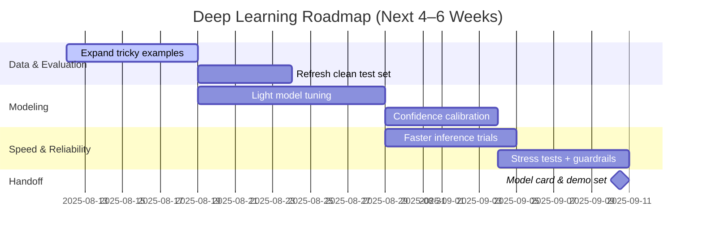

# Midterm Progress Notes — Deep Learning (Plain English)

- **Scope**: Deep Learning only (for slides). Short, clear, and a little fun.

## What we’re building (DL point of view)

- Help the system understand short text and audio: spot the feeling and give a helpful, one‑line summary.
- Do it quickly and reliably so it feels live and trustworthy.

## Biggest challenges and how we handled them

- **Messy data**
  - What we saw: duplicates, typos, and inconsistent labels.
  - What we did: cleaned it up, removed repeats, and split data fairly.
  - Result: the model learns from better examples and makes fewer avoidable mistakes.

- **Unbalanced emotions**
  - What we saw: some feelings were rare, so the model ignored them.
  - What we did: rebalanced training and added more examples where it struggled.
  - Result: fairer predictions; rare emotions show up more reliably.

- **Too slow for a smooth demo**
  - What we saw: good accuracy but the model took too long to answer.
  - What we did: made it smaller and more efficient without losing much quality.
  - Result: faster responses that fit a live, click‑and‑see experience.

- **Overconfident answers**
  - What we saw: the model said “90% sure” when it wasn’t.
  - What we did: tuned its confidence so scores better match reality.
  - Result: confidence you can actually trust.

- **Learning the training set too well**
  - What we saw: it performed great on familiar data but stumbled on fresh inputs.
  - What we did: held out clean test sets and built “tricky case” checks.
  - Result: better generalization to real‑world inputs.

- **Hard to reproduce a “good run”**
  - What we saw: tiny environment differences changed results.
  - What we did: locked our setup and recorded settings for each run.
  - Result: repeatable experiments and easier debugging.

- **Why did it fail here?**
  - What we saw: certain phrases consistently confused the model.
  - What we did: reviewed mistakes in batches, added targeted fixes and examples.
  - Result: fewer repeated errors and clearer behavior.

## What we’ve achieved so far (DL)

- Cleaner dataset and fair splits
- Better accuracy on core emotions; rare emotions improved
- Smaller, faster model with minimal quality loss
- Confidence scores that mean what they say
- Repeatable training runs with documented settings
- A ready‑to‑ship model file with clear input/output shape

## Simple picture (DL)



_Tip: If Mermaid diagrams don’t render in your viewer, open this file on GitHub or paste the code into the Mermaid Live Editor._

## How it runs in the app (API + GCP)

- We expose the model through a simple API endpoint so the app can send text or short audio and get back the emotion and a one‑line summary.
- The model runs in a container on Google Cloud (Cloud Run), so it scales when more users try it and we can see logs/metrics.

```mermaid
graph LR
    U[User input] --> A[API /predict]
    A --> M[Model container\n(GCP Cloud Run)]
    M --> R[Results JSON]
    M --> O[Logs & metrics\n(GCP)]
```

## What’s next (DL only)

- Add more “tricky” and edge‑case examples
- Tune decision thresholds so results feel right
- Push for more speed without harming quality
- Stress‑test unusual inputs and add guardrails
- Deliver a short model card and a demo‑ready example set
- Smooth out API behavior (timeouts, friendly errors) and reduce GCP cold‑starts



A tiny sprinkle of humor: feelings are hard—our model agrees, but it’s getting better at reading the room.
