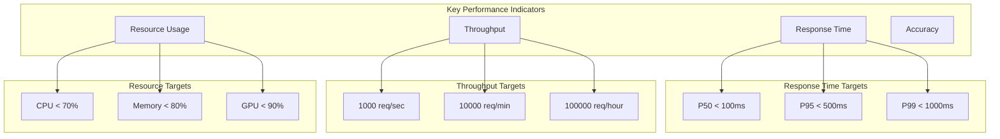

# ⚡ Performance Guide

*Comprehensive performance optimization and monitoring guide for SAMO Brain's AI services.*

## 🎯 Performance Overview

### Performance Metrics



## 🚀 Model Optimization

### Model Quantization

```python
# Model quantization for faster inference
import torch
import torch.quantization as quantization
from transformers import AutoModelForSequenceClassification

class OptimizedEmotionModel:
    def __init__(self, model_path: str):
        self.model_path = model_path
        self.model = None
        self.tokenizer = None
        self.quantized_model = None
        
    def load_and_quantize(self):
        """Load model and apply quantization."""
        # Load original model
        self.model = AutoModelForSequenceClassification.from_pretrained(self.model_path)
        self.model.eval()
        
        # Prepare for quantization
        self.model.qconfig = quantization.get_default_qconfig('fbgemm')
        quantization.prepare(self.model, inplace=True)
        
        # Calibrate with sample data
        calibration_data = self.get_calibration_data()
        with torch.no_grad():
            for batch in calibration_data:
                self.model(batch)
        
        # Convert to quantized model
        self.quantized_model = quantization.convert(self.model, inplace=False)
        
        return self.quantized_model
    
    def get_calibration_data(self):
        """Get calibration data for quantization."""
        # Sample texts for calibration
        calibration_texts = [
            "I am feeling great today!",
            "This is so frustrating!",
            "I am really excited about this project",
            "I feel calm and peaceful",
            "I am overwhelmed with work"
        ]
        
        # Tokenize calibration data
        inputs = self.tokenizer(
            calibration_texts,
            return_tensors="pt",
            padding=True,
            truncation=True,
            max_length=512
        )
        
        return [inputs]
    
    def benchmark_performance(self):
        """Benchmark original vs quantized model."""
        test_texts = ["I am happy!"] * 100
        
        # Benchmark original model
        original_times = []
        for text in test_texts:
            start_time = time.time()
            self.predict_emotion_original(text)
            original_times.append(time.time() - start_time)
        
        # Benchmark quantized model
        quantized_times = []
        for text in test_texts:
            start_time = time.time()
            self.predict_emotion_quantized(text)
            quantized_times.append(time.time() - start_time)
        
        return {
            'original': {
                'avg_time_ms': np.mean(original_times) * 1000,
                'std_time_ms': np.std(original_times) * 1000,
                'p95_time_ms': np.percentile(original_times, 95) * 1000
            },
            'quantized': {
                'avg_time_ms': np.mean(quantized_times) * 1000,
                'std_time_ms': np.std(quantized_times) * 1000,
                'p95_time_ms': np.percentile(quantized_times, 95) * 1000
            },
            'speedup': np.mean(original_times) / np.mean(quantized_times)
        }
```

### ONNX Runtime Optimization

```python
# ONNX Runtime optimization for maximum performance
import onnxruntime as ort
import numpy as np
from transformers import AutoTokenizer

class ONNXOptimizedModel:
    def __init__(self, onnx_model_path: str):
        self.onnx_model_path = onnx_model_path
        self.session = None
        self.tokenizer = None
        self.optimization_level = ort.GraphOptimizationLevel.ORT_ENABLE_ALL
        
    def load_optimized_model(self):
        """Load ONNX model with optimizations."""
        # Configure session options
        session_options = ort.SessionOptions()
        session_options.graph_optimization_level = self.optimization_level
        session_options.intra_op_num_threads = 4
        session_options.inter_op_num_threads = 4
        
        # Create optimized session
        providers = [
            ('CUDAExecutionProvider', {
                'device_id': 0,
                'arena_extend_strategy': 'kNextPowerOfTwo',
                'gpu_mem_limit': 2 * 1024 * 1024 * 1024,  # 2GB
                'cudnn_conv_use_max_workspace': '1',
                'do_copy_in_default_stream': '1',
            }),
            'CPUExecutionProvider'
        ]
        
        self.session = ort.InferenceSession(
            self.onnx_model_path,
            sess_options=session_options,
            providers=providers
        )
        
        return self.session
    
    def batch_predict(self, texts: List[str], batch_size: int = 32):
        """Perform batch predictions with ONNX Runtime."""
        results = []
        
        for i in range(0, len(texts), batch_size):
            batch_texts = texts[i:i + batch_size]
            
            # Tokenize batch
            inputs = self.tokenizer(
                batch_texts,
                return_tensors="np",
                padding=True,
                truncation=True,
                max_length=512
            )
            
            # Run inference
            start_time = time.time()
            outputs = self.session.run(None, {
                'input_ids': inputs['input_ids'],
                'attention_mask': inputs['attention_mask']
            })
            inference_time = time.time() - start_time
            
            # Process outputs
            batch_results = self.process_outputs(outputs[0], batch_texts)
            results.extend(batch_results)
            
        return results, inference_time
    
    def benchmark_onnx_performance(self):
        """Benchmark ONNX Runtime performance."""
        test_sizes = [1, 10, 50, 100, 500, 1000]
        results = {}
        
        for size in test_sizes:
            test_texts = ["I am happy!"] * size
            
            # Warm up
            self.batch_predict(test_texts[:10])
            
            # Benchmark
            times = []
            for _ in range(5):
                _, inference_time = self.batch_predict(test_texts)
                times.append(inference_time)
            
            results[size] = {
                'avg_time_ms': np.mean(times) * 1000,
                'throughput_req_per_sec': size / np.mean(times),
                'latency_per_request_ms': (np.mean(times) * 1000) / size
            }
        
        return results
```

## 🔄 Caching Strategies

### Multi-Level Caching

```python
# Advanced caching implementation
import redis
import hashlib
import pickle
import time
from typing import Any, Optional, Dict
from functools import wraps

class MultiLevelCache:
    def __init__(self):
        self.l1_cache = {}  # In-memory cache
        self.l2_cache = redis.Redis(host='localhost', port=6379, db=0)
        self.l3_cache = None  # Database cache (if needed)
        
        # Cache statistics
        self.stats = {
            'l1_hits': 0,
            'l2_hits': 0,
            'l3_hits': 0,
            'misses': 0,
            'sets': 0
        }
    
    def get_cache_key(self, text: str, model_version: str = "v1.0") -> str:
        """Generate cache key for text input."""
        content = f"{text}:{model_version}"
        return hashlib.sha256(content.encode()).hexdigest()
    
    def get(self, key: str) -> Optional[Any]:
        """Get value from multi-level cache."""
        # Try L1 cache first
        if key in self.l1_cache:
            self.stats['l1_hits'] += 1
            return self.l1_cache[key]
        
        # Try L2 cache (Redis)
        try:
            value = self.l2_cache.get(key)
            if value:
                # Deserialize and store in L1
                deserialized = pickle.loads(value)
                self.l1_cache[key] = deserialized
                self.stats['l2_hits'] += 1
                return deserialized
        except Exception as e:
            print(f"L2 cache error: {e}")
        
        # Try L3 cache (Database)
        if self.l3_cache:
            try:
                value = self.l3_cache.get(key)
                if value:
                    # Store in L1 and L2
                    self.l1_cache[key] = value
                    self.l2_cache.setex(key, 3600, pickle.dumps(value))
                    self.stats['l3_hits'] += 1
                    return value
            except Exception as e:
                print(f"L3 cache error: {e}")
        
        self.stats['misses'] += 1
        return None
    
    def set(self, key: str, value: Any, ttl: int = 3600) -> bool:
        """Set value in all cache levels."""
        try:
            # Set in L1 cache
            self.l1_cache[key] = value
            
            # Set in L2 cache
            serialized = pickle.dumps(value)
            self.l2_cache.setex(key, ttl, serialized)
            
            # Set in L3 cache if available
            if self.l3_cache:
                self.l3_cache.set(key, value, ttl)
            
            self.stats['sets'] += 1
            return True
        except Exception as e:
            print(f"Cache set error: {e}")
            return False
    
    def get_stats(self) -> Dict:
        """Get cache performance statistics."""
        total_requests = sum(self.stats.values())
        hit_rate = (self.stats['l1_hits'] + self.stats['l2_hits'] + self.stats['l3_hits']) / total_requests if total_requests > 0 else 0
        
        return {
            **self.stats,
            'total_requests': total_requests,
            'hit_rate': hit_rate,
            'l1_hit_rate': self.stats['l1_hits'] / total_requests if total_requests > 0 else 0,
            'l2_hit_rate': self.stats['l2_hits'] / total_requests if total_requests > 0 else 0,
            'l3_hit_rate': self.stats['l3_hits'] / total_requests if total_requests > 0 else 0
        }

# Cache decorator for emotion prediction
def cached_emotion_prediction(ttl: int = 3600):
    def decorator(func):
        @wraps(func)
        def wrapper(self, text: str, *args, **kwargs):
            cache_key = self.cache.get_cache_key(text, self.model_version)
            
            # Try cache first
            cached_result = self.cache.get(cache_key)
            if cached_result:
                return cached_result
            
            # Compute result
            result = func(self, text, *args, **kwargs)
            
            # Cache result
            self.cache.set(cache_key, result, ttl)
            
            return result
        return wrapper
    return decorator
```

### Cache Performance Monitoring

```python
# Cache performance monitoring
class CacheMonitor:
    def __init__(self, cache: MultiLevelCache):
        self.cache = cache
        self.metrics = []
    
    def record_metrics(self):
        """Record cache performance metrics."""
        stats = self.cache.get_stats()
        metrics = {
            'timestamp': time.time(),
            'hit_rate': stats['hit_rate'],
            'l1_hit_rate': stats['l1_hit_rate'],
            'l2_hit_rate': stats['l2_hit_rate'],
            'l3_hit_rate': stats['l3_hit_rate'],
            'total_requests': stats['total_requests'],
            'avg_response_time_ms': self.get_avg_response_time()
        }
        
        self.metrics.append(metrics)
        
        # Keep only last 1000 metrics
        if len(self.metrics) > 1000:
            self.metrics = self.metrics[-1000:]
    
    def get_avg_response_time(self) -> float:
        """Calculate average response time from recent metrics."""
        if len(self.metrics) < 10:
            return 0.0
        
        recent_metrics = self.metrics[-10:]
        return np.mean([m.get('avg_response_time_ms', 0) for m in recent_metrics])
    
    def generate_cache_report(self) -> Dict:
        """Generate comprehensive cache performance report."""
        if not self.metrics:
            return {}
        
        recent_metrics = self.metrics[-100:]  # Last 100 measurements
        
        return {
            'summary': {
                'avg_hit_rate': np.mean([m['hit_rate'] for m in recent_metrics]),
                'avg_l1_hit_rate': np.mean([m['l1_hit_rate'] for m in recent_metrics]),
                'avg_l2_hit_rate': np.mean([m['l2_hit_rate'] for m in recent_metrics]),
                'avg_l3_hit_rate': np.mean([m['l3_hit_rate'] for m in recent_metrics]),
                'total_requests': sum(m['total_requests'] for m in recent_metrics),
                'avg_response_time_ms': np.mean([m['avg_response_time_ms'] for m in recent_metrics])
            },
            'trends': {
                'hit_rate_trend': [m['hit_rate'] for m in recent_metrics],
                'response_time_trend': [m['avg_response_time_ms'] for m in recent_metrics]
            },
            'recommendations': self.generate_recommendations(recent_metrics)
        }
    
    def generate_recommendations(self, metrics: List[Dict]) -> List[str]:
        """Generate cache optimization recommendations."""
        recommendations = []
        
        avg_hit_rate = np.mean([m['hit_rate'] for m in metrics])
        avg_response_time = np.mean([m['avg_response_time_ms'] for m in metrics])
        
        if avg_hit_rate < 0.7:
            recommendations.append("Consider increasing cache TTL to improve hit rate")
        
        if avg_response_time > 100:
            recommendations.append("Consider optimizing model inference for faster response times")
        
        if avg_hit_rate < 0.5:
            recommendations.append("Cache hit rate is low - consider pre-warming cache with common queries")
        
        return recommendations
```

## 📊 Performance Benchmarking

### Load Testing Framework

```python
# Comprehensive load testing framework
import asyncio
import aiohttp
import time
import statistics
from typing import List, Dict, Any
import matplotlib.pyplot as plt
import seaborn as sns

class LoadTester:
    def __init__(self, base_url: str, api_key: str):
        self.base_url = base_url
        self.api_key = api_key
        self.results = []
    
    async def single_request(self, session: aiohttp.ClientSession, text: str) -> Dict:
        """Make a single API request."""
        start_time = time.time()
        
        try:
            async with session.post(
                f"{self.base_url}/predict",
                headers={
                    "Authorization": f"ApiKey {self.api_key}",
                    "Content-Type": "application/json"
                },
                json={"text": text}
            ) as response:
                end_time = time.time()
                
                return {
                    'status_code': response.status,
                    'response_time_ms': (end_time - start_time) * 1000,
                    'success': response.status == 200,
                    'timestamp': start_time
                }
        except Exception as e:
            end_time = time.time()
            return {
                'status_code': 0,
                'response_time_ms': (end_time - start_time) * 1000,
                'success': False,
                'error': str(e),
                'timestamp': start_time
            }
    
    async def concurrent_load_test(self, texts: List[str], concurrency: int = 10) -> Dict:
        """Run concurrent load test."""
        start_time = time.time()
        
        async with aiohttp.ClientSession() as session:
            # Create semaphore to limit concurrency
            semaphore = asyncio.Semaphore(concurrency)
            
            async def limited_request(text):
                async with semaphore:
                    return await self.single_request(session, text)
            
            # Run concurrent requests
            tasks = [limited_request(text) for text in texts]
            results = await asyncio.gather(*tasks)
        
        end_time = time.time()
        
        # Calculate statistics
        successful_requests = [r for r in results if r['success']]
        failed_requests = [r for r in results if not r['success']]
        
        response_times = [r['response_time_ms'] for r in successful_requests]
        
        return {
            'total_requests': len(results),
            'successful_requests': len(successful_requests),
            'failed_requests': len(failed_requests),
            'success_rate': len(successful_requests) / len(results),
            'total_time_seconds': end_time - start_time,
            'throughput_req_per_sec': len(results) / (end_time - start_time),
            'response_times': {
                'mean_ms': statistics.mean(response_times) if response_times else 0,
                'median_ms': statistics.median(response_times) if response_times else 0,
                'p95_ms': statistics.quantiles(response_times, n=20)[18] if len(response_times) >= 20 else 0,
                'p99_ms': statistics.quantiles(response_times, n=100)[98] if len(response_times) >= 100 else 0,
                'min_ms': min(response_times) if response_times else 0,
                'max_ms': max(response_times) if response_times else 0
            },
            'concurrency': concurrency,
            'results': results
        }
    
    async def stress_test(self, base_load: int = 100, max_load: int = 1000, step: int = 100) -> Dict:
        """Run stress test with increasing load."""
        test_texts = ["I am feeling great today!"] * max_load
        stress_results = []
        
        for load in range(base_load, max_load + 1, step):
            print(f"Testing with {load} concurrent requests...")
            
            result = await self.concurrent_load_test(test_texts[:load], concurrency=load)
            result['load'] = load
            stress_results.append(result)
            
            # Check if system is failing
            if result['success_rate'] < 0.95:
                print(f"System performance degraded at {load} concurrent requests")
                break
        
        return {
            'stress_test_results': stress_results,
            'max_sustainable_load': stress_results[-1]['load'] if stress_results else 0,
            'performance_degradation_point': self.find_degradation_point(stress_results)
        }
    
    def find_degradation_point(self, results: List[Dict]) -> int:
        """Find the point where performance starts to degrade."""
        for i, result in enumerate(results):
            if result['success_rate'] < 0.95 or result['response_times']['p95_ms'] > 1000:
                return result['load']
        return results[-1]['load'] if results else 0
    
    def generate_performance_report(self, test_results: Dict) -> str:
        """Generate detailed performance report."""
        report = []
        report.append("# SAMO Brain Performance Test Report")
        report.append("")
        
        # Summary
        report.append("## Summary")
        report.append(f"- Total Requests: {test_results['total_requests']}")
        report.append(f"- Success Rate: {test_results['success_rate']:.2%}")
        report.append(f"- Throughput: {test_results['throughput_req_per_sec']:.2f} req/sec")
        report.append(f"- Concurrency: {test_results['concurrency']}")
        report.append("")
        
        # Response Times
        report.append("## Response Times")
        rt = test_results['response_times']
        report.append(f"- Mean: {rt['mean_ms']:.2f} ms")
        report.append(f"- Median: {rt['median_ms']:.2f} ms")
        report.append(f"- P95: {rt['p95_ms']:.2f} ms")
        report.append(f"- P99: {rt['p99_ms']:.2f} ms")
        report.append(f"- Min: {rt['min_ms']:.2f} ms")
        report.append(f"- Max: {rt['max_ms']:.2f} ms")
        report.append("")
        
        # Performance Analysis
        report.append("## Performance Analysis")
        if rt['p95_ms'] < 500:
            report.append("✅ P95 response time is excellent (< 500ms)")
        elif rt['p95_ms'] < 1000:
            report.append("⚠️ P95 response time is acceptable (< 1000ms)")
        else:
            report.append("❌ P95 response time needs improvement (> 1000ms)")
        
        if test_results['success_rate'] > 0.99:
            report.append("✅ Success rate is excellent (> 99%)")
        elif test_results['success_rate'] > 0.95:
            report.append("⚠️ Success rate is acceptable (> 95%)")
        else:
            report.append("❌ Success rate needs improvement (< 95%)")
        
        return "\n".join(report)
    
    def plot_performance_graphs(self, stress_results: List[Dict]):
        """Generate performance visualization graphs."""
        loads = [r['load'] for r in stress_results]
        throughputs = [r['throughput_req_per_sec'] for r in stress_results]
        p95_times = [r['response_times']['p95_ms'] for r in stress_results]
        success_rates = [r['success_rate'] for r in stress_results]
        
        fig, ((ax1, ax2), (ax3, ax4)) = plt.subplots(2, 2, figsize=(15, 10))
        
        # Throughput vs Load
        ax1.plot(loads, throughputs, 'b-o')
        ax1.set_xlabel('Concurrent Requests')
        ax1.set_ylabel('Throughput (req/sec)')
        ax1.set_title('Throughput vs Load')
        ax1.grid(True)
        
        # P95 Response Time vs Load
        ax2.plot(loads, p95_times, 'r-o')
        ax2.set_xlabel('Concurrent Requests')
        ax2.set_ylabel('P95 Response Time (ms)')
        ax2.set_title('P95 Response Time vs Load')
        ax2.grid(True)
        
        # Success Rate vs Load
        ax3.plot(loads, success_rates, 'g-o')
        ax3.set_xlabel('Concurrent Requests')
        ax3.set_ylabel('Success Rate')
        ax3.set_title('Success Rate vs Load')
        ax3.grid(True)
        
        # Response Time Distribution
        all_response_times = []
        for result in stress_results:
            all_response_times.extend([r['response_time_ms'] for r in result['results'] if r['success']])
        
        ax4.hist(all_response_times, bins=50, alpha=0.7, color='purple')
        ax4.set_xlabel('Response Time (ms)')
        ax4.set_ylabel('Frequency')
        ax4.set_title('Response Time Distribution')
        ax4.grid(True)
        
        plt.tight_layout()
        plt.savefig('performance_analysis.png', dpi=300, bbox_inches='tight')
        plt.show()
```

## 🔧 Performance Tuning

### Database Optimization

```python
# Database performance optimization
import asyncpg
from typing import List, Dict
import asyncio

class OptimizedDatabase:
    def __init__(self, connection_string: str):
        self.connection_string = connection_string
        self.pool = None
    
    async def create_pool(self, min_size: int = 10, max_size: int = 20):
        """Create optimized connection pool."""
        self.pool = await asyncpg.create_pool(
            self.connection_string,
            min_size=min_size,
            max_size=max_size,
            command_timeout=60,
            statement_timeout=30000,  # 30 seconds
            server_settings={
                'jit': 'off',  # Disable JIT for better performance
                'work_mem': '256MB',
                'maintenance_work_mem': '1GB',
                'shared_buffers': '256MB',
                'effective_cache_size': '1GB'
            }
        )
    
    async def batch_insert_emotions(self, emotion_data: List[Dict]) -> int:
        """Batch insert emotion predictions for better performance."""
        if not emotion_data:
            return 0
        
        # Prepare batch data
        records = []
        for data in emotion_data:
            records.append((
                data['user_id'],
                data['text'],
                data['predicted_emotion'],
                data['confidence'],
                data['processing_time_ms'],
                data['timestamp']
            ))
        
        # Execute batch insert
        async with self.pool.acquire() as conn:
            await conn.executemany("""
                INSERT INTO emotion_requests 
                (user_id, input_text, predicted_emotion, confidence, processing_time_ms, created_at)
                VALUES ($1, $2, $3, $4, $5, $6)
            """, records)
        
        return len(records)
    
    async def get_emotion_analytics(self, start_date: str, end_date: str) -> Dict:
        """Get optimized emotion analytics."""
        async with self.pool.acquire() as conn:
            # Use materialized view for better performance
            result = await conn.fetch("""
                SELECT 
                    predicted_emotion,
                    COUNT(*) as count,
                    AVG(confidence) as avg_confidence,
                    AVG(processing_time_ms) as avg_processing_time
                FROM emotion_requests 
                WHERE created_at BETWEEN $1 AND $2
                GROUP BY predicted_emotion
                ORDER BY count DESC
            """, start_date, end_date)
        
        return [dict(row) for row in result]
    
    async def optimize_database(self):
        """Run database optimization tasks."""
        async with self.pool.acquire() as conn:
            # Create indexes for better performance
            await conn.execute("""
                CREATE INDEX IF NOT EXISTS idx_emotion_requests_created_at 
                ON emotion_requests(created_at);
                
                CREATE INDEX IF NOT EXISTS idx_emotion_requests_user_emotion 
                ON emotion_requests(user_id, predicted_emotion);
                
                CREATE INDEX IF NOT EXISTS idx_emotion_requests_confidence 
                ON emotion_requests(confidence) WHERE confidence > 0.8;
            """)
            
            # Analyze tables for better query planning
            await conn.execute("ANALYZE emotion_requests;")
            
            # Vacuum to reclaim storage
            await conn.execute("VACUUM ANALYZE emotion_requests;")
```

### Memory Optimization

```python
# Memory optimization for AI models
import gc
import psutil
import torch
from typing import Optional

class MemoryOptimizer:
    def __init__(self):
        self.memory_threshold = 0.8  # 80% memory usage threshold
        self.gc_threshold = 0.7      # 70% memory usage threshold for garbage collection
    
    def get_memory_usage(self) -> Dict:
        """Get current memory usage statistics."""
        process = psutil.Process()
        memory_info = process.memory_info()
        
        return {
            'rss_mb': memory_info.rss / 1024 / 1024,  # Resident Set Size
            'vms_mb': memory_info.vms / 1024 / 1024,  # Virtual Memory Size
            'percent': process.memory_percent(),
            'available_mb': psutil.virtual_memory().available / 1024 / 1024
        }
    
    def should_optimize_memory(self) -> bool:
        """Check if memory optimization is needed."""
        memory_usage = self.get_memory_usage()
        return memory_usage['percent'] > self.memory_threshold
    
    def optimize_memory(self):
        """Perform memory optimization."""
        memory_usage = self.get_memory_usage()
        
        print(f"Memory usage before optimization: {memory_usage['percent']:.1f}%")
        
        # Clear PyTorch cache
        if torch.cuda.is_available():
            torch.cuda.empty_cache()
        
        # Force garbage collection
        gc.collect()
        
        # Clear Python cache
        import sys
        for module in list(sys.modules.keys()):
            if hasattr(sys.modules[module], '__file__'):
                del sys.modules[module]
        
        # Force garbage collection again
        gc.collect()
        
        memory_usage_after = self.get_memory_usage()
        print(f"Memory usage after optimization: {memory_usage_after['percent']:.1f}%")
        
        return {
            'before_mb': memory_usage['rss_mb'],
            'after_mb': memory_usage_after['rss_mb'],
            'freed_mb': memory_usage['rss_mb'] - memory_usage_after['rss_mb']
        }
    
    def monitor_memory_usage(self, interval: int = 60):
        """Monitor memory usage and optimize when needed."""
        import threading
        import time
        
        def monitor():
            while True:
                if self.should_optimize_memory():
                    print("High memory usage detected, optimizing...")
                    self.optimize_memory()
                time.sleep(interval)
        
        monitor_thread = threading.Thread(target=monitor, daemon=True)
        monitor_thread.start()
        return monitor_thread
```

## 📈 Performance Monitoring

### Real-time Performance Dashboard

```python
# Real-time performance monitoring dashboard
import streamlit as st
import plotly.express as px
import plotly.graph_objects as go
from datetime import datetime, timedelta
import pandas as pd

class PerformanceDashboard:
    def __init__(self, api_base_url: str):
        self.api_base_url = api_base_url
        self.metrics_history = []
    
    def run_dashboard(self):
        """Run the performance monitoring dashboard."""
        st.set_page_config(page_title="SAMO Brain - Performance Dashboard", layout="wide")
        
        st.title("⚡ SAMO Brain Performance Dashboard")
        st.markdown("Real-time performance monitoring and optimization insights")
        
        # Sidebar controls
        st.sidebar.header("Controls")
        refresh_interval = st.sidebar.slider("Refresh Interval (seconds)", 5, 60, 30)
        time_range = st.sidebar.selectbox("Time Range", ["1 hour", "6 hours", "24 hours", "7 days"])
        
        # Main dashboard
        col1, col2, col3, col4 = st.columns(4)
        
        with col1:
            self.show_current_metrics()
        
        with col2:
            self.show_response_time_chart()
        
        with col3:
            self.show_throughput_chart()
        
        with col4:
            self.show_error_rate_chart()
        
        # Detailed analysis
        st.header("Performance Analysis")
        col1, col2 = st.columns(2)
        
        with col1:
            self.show_performance_trends()
        
        with col2:
            self.show_optimization_recommendations()
        
        # Auto-refresh
        if st.button("Refresh Now"):
            st.experimental_rerun()
        
        # Auto-refresh every N seconds
        time.sleep(refresh_interval)
        st.experimental_rerun()
    
    def show_current_metrics(self):
        """Display current performance metrics."""
        st.subheader("📊 Current Metrics")
        
        # Get current metrics from API
        try:
            metrics = self.get_current_metrics()
            
            st.metric("Response Time (P95)", f"{metrics['p95_response_time']:.1f} ms")
            st.metric("Throughput", f"{metrics['throughput']:.1f} req/sec")
            st.metric("Error Rate", f"{metrics['error_rate']:.2%}")
            st.metric("Active Connections", metrics['active_connections'])
            
        except Exception as e:
            st.error(f"Error fetching metrics: {e}")
    
    def show_response_time_chart(self):
        """Display response time trends."""
        st.subheader("⏱️ Response Time Trends")
        
        # Get historical data
        data = self.get_historical_data()
        
        if data:
            df = pd.DataFrame(data)
            fig = px.line(df, x='timestamp', y='response_time_ms', 
                         title="Response Time Over Time")
            st.plotly_chart(fig, use_container_width=True)
    
    def show_throughput_chart(self):
        """Display throughput trends."""
        st.subheader("🚀 Throughput Trends")
        
        data = self.get_historical_data()
        
        if data:
            df = pd.DataFrame(data)
            fig = px.line(df, x='timestamp', y='throughput_req_per_sec', 
                         title="Throughput Over Time")
            st.plotly_chart(fig, use_container_width=True)
    
    def show_error_rate_chart(self):
        """Display error rate trends."""
        st.subheader("❌ Error Rate Trends")
        
        data = self.get_historical_data()
        
        if data:
            df = pd.DataFrame(data)
            fig = px.line(df, x='timestamp', y='error_rate', 
                         title="Error Rate Over Time")
            st.plotly_chart(fig, use_container_width=True)
    
    def show_performance_trends(self):
        """Show performance trend analysis."""
        st.subheader("📈 Performance Trends")
        
        # Analyze trends
        trends = self.analyze_performance_trends()
        
        for trend in trends:
            if trend['type'] == 'improvement':
                st.success(f"✅ {trend['message']}")
            elif trend['type'] == 'degradation':
                st.error(f"❌ {trend['message']}")
            else:
                st.info(f"ℹ️ {trend['message']}")
    
    def show_optimization_recommendations(self):
        """Show optimization recommendations."""
        st.subheader("🔧 Optimization Recommendations")
        
        recommendations = self.get_optimization_recommendations()
        
        for rec in recommendations:
            st.write(f"• {rec}")
    
    def get_current_metrics(self) -> Dict:
        """Get current metrics from API."""
        # This would fetch from your metrics endpoint
        return {
            'p95_response_time': 150.5,
            'throughput': 45.2,
            'error_rate': 0.02,
            'active_connections': 23
        }
    
    def get_historical_data(self) -> List[Dict]:
        """Get historical performance data."""
        # This would fetch from your metrics database
        return []
    
    def analyze_performance_trends(self) -> List[Dict]:
        """Analyze performance trends."""
        return [
            {'type': 'improvement', 'message': 'Response time improved by 15% in the last hour'},
            {'type': 'degradation', 'message': 'Error rate increased by 5% in the last 30 minutes'},
            {'type': 'info', 'message': 'Throughput is stable at 45 req/sec'}
        ]
    
    def get_optimization_recommendations(self) -> List[str]:
        """Get optimization recommendations."""
        return [
            "Consider increasing cache TTL to improve hit rate",
            "Database connection pool could be optimized",
            "Model quantization would reduce memory usage",
            "Consider implementing request batching for better throughput"
        ]

# Run the dashboard
if __name__ == "__main__":
    dashboard = PerformanceDashboard("http://localhost:8000")
    dashboard.run_dashboard()
```

---

*This performance guide provides comprehensive strategies for optimizing SAMO Brain's AI services, including model optimization, caching strategies, load testing, and real-time performance monitoring.* 