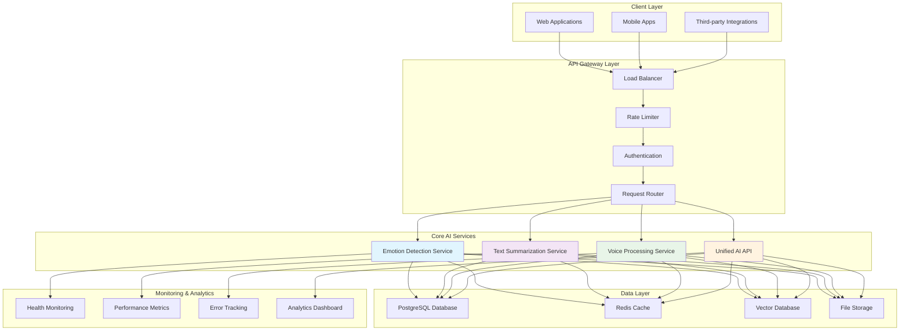

# 🏗️ System Architecture

*Comprehensive technical architecture documentation for SAMO Brain's AI-powered emotion detection and analysis system.*

## 🎯 Architecture Overview

### System Components



## 🔧 Core Components

### Emotion Detection Service

```python
# Core emotion detection architecture
class EmotionDetectionService:
    def __init__(self):
        self.model = self.load_bert_model()
        self.tokenizer = self.load_tokenizer()
        self.label_mapping = self.get_emotion_labels()
        self.cache = RedisCache()

    def load_bert_model(self):
        """Load optimized BERT model for emotion classification."""
        model_path = "models/emotion_detection/bert_classifier"
        model = AutoModelForSequenceClassification.from_pretrained(model_path)
        model.eval()
        return model

    def predict_emotion(self, text: str) -> Dict:
        """Predict emotion from text input."""
        # Check cache first
        cache_key = f"emotion:{hash(text)}"
        cached_result = self.cache.get(cache_key)
        if cached_result:
            return cached_result

        # Preprocess text
        processed_text = self.preprocess_text(text)

        # Tokenize
        inputs = self.tokenizer(
            processed_text,
            return_tensors="pt",
            truncation=True,
            max_length=512,
            padding=True
        )

        # Predict
        with torch.no_grad():
            outputs = self.model(**inputs)
            probabilities = torch.softmax(outputs.logits, dim=1)

        # Post-process results
        result = self.postprocess_predictions(probabilities)

        # Cache result
        self.cache.set(cache_key, result, ttl=3600)

        return result

    def preprocess_text(self, text: str) -> str:
        """Clean and normalize text input."""
        # Remove special characters
        text = re.sub(r'[^\w\s]', '', text)

        # Normalize whitespace
        text = ' '.join(text.split())

        # Convert to lowercase
        text = text.lower()

        return text

    def postprocess_predictions(self, probabilities: torch.Tensor) -> Dict:
        """Convert model outputs to user-friendly format."""
        probs = probabilities.squeeze().numpy()

        # Get predicted emotion
        predicted_idx = np.argmax(probs)
        predicted_emotion = self.label_mapping[predicted_idx]
        confidence = float(probs[predicted_idx])

        # Create probability distribution
        emotion_probs = {
            self.label_mapping[i]: float(probs[i])
            for i in range(len(self.label_mapping))
        }

        return {
            'predicted_emotion': predicted_emotion,
            'confidence': confidence,
            'probabilities': emotion_probs,
            'prediction_time_ms': self.get_prediction_time()
        }
```

### Unified AI API

```python
# Unified API for all AI services
class UnifiedAIService:
    def __init__(self):
        self.emotion_service = EmotionDetectionService()
        self.summarization_service = SummarizationService()
        self.voice_service = VoiceProcessingService()
        self.rate_limiter = RateLimiter()
        self.metrics = MetricsCollector()

    async def process_text(self, text: str, services: List[str]) -> Dict:
        """Process text through multiple AI services."""
        results = {}

        if 'emotion' in services:
            emotion_result = await self.emotion_service.predict_emotion(text)
            results['emotion'] = emotion_result

        if 'summarization' in services:
            summary_result = await self.summarization_service.summarize(text)
            results['summarization'] = summary_result

        return {
            'input_text': text,
            'services_used': services,
            'results': results,
            'processing_time_ms': self.get_processing_time(),
            'timestamp': datetime.now().isoformat()
        }

    async def process_audio(self, audio_data: bytes) -> Dict:
        """Process audio through voice processing pipeline."""
        # Convert audio to text
        text_result = await self.voice_service.speech_to_text(audio_data)

        # Analyze emotion from transcribed text
        emotion_result = await self.emotion_service.predict_emotion(text_result['text'])

        return {
            'audio_processing': text_result,
            'emotion_analysis': emotion_result,
            'processing_time_ms': self.get_processing_time()
        }
```

## 🌐 API Gateway Architecture

### Load Balancer Configuration

```yaml
# Nginx load balancer configuration
upstream samo_brain_backend {
    least_conn;  # Least connections algorithm

    # Primary servers
    server 10.0.1.10:8000 weight=3 max_fails=3 fail_timeout=30s;
    server 10.0.1.11:8000 weight=3 max_fails=3 fail_timeout=30s;
    server 10.0.1.12:8000 weight=3 max_fails=3 fail_timeout=30s;

    # Backup servers
    server 10.0.1.13:8000 weight=1 max_fails=3 fail_timeout=30s backup;
    server 10.0.1.14:8000 weight=1 max_fails=3 fail_timeout=30s backup;

    keepalive 32;
}

server {
    listen 80;
    server_name api.samobrain.com;

    # Rate limiting
    limit_req_zone $binary_remote_addr zone=api_limit:10m rate=10r/s;
    limit_req zone=api_limit burst=20 nodelay;

    # Security headers
    add_header X-Frame-Options DENY;
    add_header X-Content-Type-Options nosniff;
    add_header X-XSS-Protection "1; mode=block";
    add_header Strict-Transport-Security "max-age=31536000; includeSubDomains";

    location / {
        proxy_pass http://samo_brain_backend;
        proxy_set_header Host $host;
        proxy_set_header X-Real-IP $remote_addr;
        proxy_set_header X-Forwarded-For $proxy_add_x_forwarded_for;
        proxy_set_header X-Forwarded-Proto $scheme;

        # Timeouts
        proxy_connect_timeout 5s;
        proxy_send_timeout 60s;
        proxy_read_timeout 60s;

        # Buffering
        proxy_buffering on;
        proxy_buffer_size 4k;
        proxy_buffers 8 4k;
    }

    # Health check endpoint
    location /health {
        access_log off;
        return 200 "healthy\n";
        add_header Content-Type text/plain;
    }
}
```

### Rate Limiting Implementation

```python
# Advanced rate limiting with sliding window
class SlidingWindowRateLimiter:
    def __init__(self, window_size: int = 60, max_requests: int = 100):
        self.window_size = window_size
        self.max_requests = max_requests
        self.redis_client = redis.Redis(host='localhost', port=6379, db=0)

    def is_allowed(self, client_id: str) -> bool:
        """Check if request is allowed based on rate limit."""
        current_time = time.time()
        window_start = current_time - self.window_size

        # Get requests in current window
        pipeline = self.redis_client.pipeline()
        pipeline.zremrangebyscore(f"rate_limit:{client_id}", 0, window_start)
        pipeline.zadd(f"rate_limit:{client_id}", {str(current_time): current_time})
        pipeline.zcard(f"rate_limit:{client_id}")
        pipeline.expire(f"rate_limit:{client_id}", self.window_size)
        results = pipeline.execute()

        request_count = results[2]
        return request_count <= self.max_requests

    def get_remaining_requests(self, client_id: str) -> int:
        """Get remaining requests for client."""
        current_time = time.time()
        window_start = current_time - self.window_size

        # Clean old requests and count current ones
        self.redis_client.zremrangebyscore(f"rate_limit:{client_id}", 0, window_start)
        request_count = self.redis_client.zcard(f"rate_limit:{client_id}")

        return max(0, self.max_requests - request_count)
```

## 🗄️ Data Architecture

### Database Schema

```sql
-- Core database schema for SAMO Brain
CREATE TABLE users (
    id UUID PRIMARY KEY DEFAULT gen_random_uuid(),
    email VARCHAR(255) UNIQUE NOT NULL,
    api_key_hash VARCHAR(255) UNIQUE NOT NULL,
    rate_limit_tier VARCHAR(50) DEFAULT 'standard',
    created_at TIMESTAMP DEFAULT CURRENT_TIMESTAMP,
    updated_at TIMESTAMP DEFAULT CURRENT_TIMESTAMP
);

CREATE TABLE emotion_requests (
    id UUID PRIMARY KEY DEFAULT gen_random_uuid(),
    user_id UUID REFERENCES users(id),
    input_text TEXT NOT NULL,
    predicted_emotion VARCHAR(50) NOT NULL,
    confidence DECIMAL(5,4) NOT NULL,
    processing_time_ms INTEGER NOT NULL,
    ip_address INET,
    user_agent TEXT,
    created_at TIMESTAMP DEFAULT CURRENT_TIMESTAMP
);

CREATE TABLE emotion_probabilities (
    id UUID PRIMARY KEY DEFAULT gen_random_uuid(),
    request_id UUID REFERENCES emotion_requests(id),
    emotion VARCHAR(50) NOT NULL,
    probability DECIMAL(5,4) NOT NULL,
    created_at TIMESTAMP DEFAULT CURRENT_TIMESTAMP
);

CREATE TABLE system_metrics (
    id UUID PRIMARY KEY DEFAULT gen_random_uuid(),
    metric_name VARCHAR(100) NOT NULL,
    metric_value DECIMAL(10,4) NOT NULL,
    metric_unit VARCHAR(20),
    tags JSONB,
    recorded_at TIMESTAMP DEFAULT CURRENT_TIMESTAMP
);

-- Indexes for performance
CREATE INDEX idx_emotion_requests_user_id ON emotion_requests(user_id);
CREATE INDEX idx_emotion_requests_created_at ON emotion_requests(created_at);
CREATE INDEX idx_emotion_requests_emotion ON emotion_requests(predicted_emotion);
CREATE INDEX idx_system_metrics_name_time ON system_metrics(metric_name, recorded_at);

-- Partitioning for large tables
CREATE TABLE emotion_requests_partitioned (
    LIKE emotion_requests INCLUDING ALL
) PARTITION BY RANGE (created_at);

-- Create monthly partitions
CREATE TABLE emotion_requests_2024_01 PARTITION OF emotion_requests_partitioned
    FOR VALUES FROM ('2024-01-01') TO ('2024-02-01');

CREATE TABLE emotion_requests_2024_02 PARTITION OF emotion_requests_partitioned
    FOR VALUES FROM ('2024-02-01') TO ('2024-03-01');
```

### Caching Strategy

```python
# Multi-layer caching implementation
class CacheManager:
    def __init__(self):
        self.l1_cache = {}  # In-memory cache
        self.l2_cache = redis.Redis(host='localhost', port=6379, db=1)  # Redis cache
        self.l3_cache = None  # Database cache (if needed)

    def get(self, key: str) -> Optional[Any]:
        """Get value from cache with fallback strategy."""
        # Try L1 cache first
        if key in self.l1_cache:
            return self.l1_cache[key]

        # Try L2 cache
        try:
            value = self.l2_cache.get(key)
            if value:
                # Deserialize and store in L1
                deserialized = json.loads(value)
                self.l1_cache[key] = deserialized
                return deserialized
        except Exception as e:
            logger.warning(f"L2 cache error: {e}")

        return None

    def set(self, key: str, value: Any, ttl: int = 3600) -> bool:
        """Set value in cache layers."""
        try:
            # Set in L1 cache
            self.l1_cache[key] = value

            # Set in L2 cache
            serialized = json.dumps(value)
            self.l2_cache.setex(key, ttl, serialized)

            return True
        except Exception as e:
            logger.error(f"Cache set error: {e}")
            return False

    def invalidate(self, pattern: str) -> bool:
        """Invalidate cache entries matching pattern."""
        try:
            # Clear L1 cache entries
            keys_to_remove = [k for k in self.l1_cache.keys() if pattern in k]
            for key in keys_to_remove:
                del self.l1_cache[key]

            # Clear L2 cache entries
            keys = self.l2_cache.keys(pattern)
            if keys:
                self.l2_cache.delete(*keys)

            return True
        except Exception as e:
            logger.error(f"Cache invalidation error: {e}")
            return False
```

## 🔒 Security Architecture

### Authentication & Authorization

```python
# JWT-based authentication system
class AuthenticationService:
    def __init__(self):
        self.secret_key = os.getenv('JWT_SECRET_KEY')
        self.algorithm = 'HS256'
        self.access_token_expire_minutes = 30
        self.refresh_token_expire_days = 7

    def create_access_token(self, user_id: str, permissions: List[str]) -> str:
        """Create JWT access token."""
        payload = {
            'sub': user_id,
            'permissions': permissions,
            'type': 'access',
            'exp': datetime.utcnow() + timedelta(minutes=self.access_token_expire_minutes)
        }

        return jwt.encode(payload, self.secret_key, algorithm=self.algorithm)

    def verify_token(self, token: str) -> Optional[Dict]:
        """Verify and decode JWT token."""
        try:
            payload = jwt.decode(token, self.secret_key, algorithms=[self.algorithm])
            return payload
        except jwt.ExpiredSignatureError:
            raise HTTPException(status_code=401, detail="Token expired")
        except jwt.InvalidTokenError:
            raise HTTPException(status_code=401, detail="Invalid token")

    def check_permission(self, token: str, required_permission: str) -> bool:
        """Check if token has required permission."""
        payload = self.verify_token(token)
        if not payload:
            return False

        permissions = payload.get('permissions', [])
        return required_permission in permissions

# API Key authentication
class APIKeyAuth:
    def __init__(self):
        self.db = Database()

    async def authenticate_api_key(self, api_key: str) -> Optional[Dict]:
        """Authenticate API key and return user info."""
        try:
            # Hash the provided API key
            hashed_key = hashlib.sha256(api_key.encode()).hexdigest()

            # Query database
            query = "SELECT id, email, rate_limit_tier FROM users WHERE api_key_hash = $1"
            result = await self.db.fetch_one(query, hashed_key)

            if result:
                return {
                    'user_id': result['id'],
                    'email': result['email'],
                    'rate_limit_tier': result['rate_limit_tier']
                }

            return None
        except Exception as e:
            logger.error(f"API key authentication error: {e}")
            return None
```

## 📊 Monitoring & Observability

### Health Check System

```python
# Comprehensive health checking
class HealthChecker:
    def __init__(self):
        self.checks = {
            'database': self.check_database,
            'redis': self.check_redis,
            'model': self.check_model,
            'api': self.check_api_endpoints
        }

    async def run_health_checks(self) -> Dict:
        """Run all health checks."""
        results = {}

        for check_name, check_func in self.checks.items():
            try:
                start_time = time.time()
                result = await check_func()
                end_time = time.time()

                results[check_name] = {
                    'status': 'healthy' if result else 'unhealthy',
                    'response_time_ms': round((end_time - start_time) * 1000, 2),
                    'timestamp': datetime.now().isoformat()
                }
            except Exception as e:
                results[check_name] = {
                    'status': 'error',
                    'error': str(e),
                    'timestamp': datetime.now().isoformat()
                }

        overall_status = 'healthy' if all(
            r['status'] == 'healthy' for r in results.values()
        ) else 'unhealthy'

        return {
            'status': overall_status,
            'checks': results,
            'timestamp': datetime.now().isoformat()
        }

    async def check_database(self) -> bool:
        """Check database connectivity."""
        try:
            await self.db.execute("SELECT 1")
            return True
        except Exception:
            return False

    async def check_redis(self) -> bool:
        """Check Redis connectivity."""
        try:
            self.redis_client.ping()
            return True
        except Exception:
            return False

    async def check_model(self) -> bool:
        """Check if AI model is loaded and responsive."""
        try:
            test_text = "This is a test"
            result = await self.emotion_service.predict_emotion(test_text)
            return result is not None
        except Exception:
            return False
```

### Metrics Collection

```python
# Prometheus metrics collection
from prometheus_client import Counter, Histogram, Gauge, generate_latest

class MetricsCollector:
    def __init__(self):
        # Request metrics
        self.request_counter = Counter(
            'samo_brain_requests_total',
            'Total number of requests',
            ['endpoint', 'method', 'status_code']
        )

        self.request_duration = Histogram(
            'samo_brain_request_duration_seconds',
            'Request duration in seconds',
            ['endpoint', 'method']
        )

        # Emotion prediction metrics
        self.emotion_predictions = Counter(
            'samo_brain_emotion_predictions_total',
            'Total emotion predictions',
            ['emotion', 'confidence_bucket']
        )

        # System metrics
        self.active_connections = Gauge(
            'samo_brain_active_connections',
            'Number of active connections'
        )

        self.model_memory_usage = Gauge(
            'samo_brain_model_memory_bytes',
            'Memory usage of AI models in bytes'
        )

    def record_request(self, endpoint: str, method: str, status_code: int, duration: float):
        """Record request metrics."""
        self.request_counter.labels(endpoint=endpoint, method=method, status_code=status_code).inc()
        self.request_duration.labels(endpoint=endpoint, method=method).observe(duration)

    def record_emotion_prediction(self, emotion: str, confidence: float):
        """Record emotion prediction metrics."""
        confidence_bucket = self.get_confidence_bucket(confidence)
        self.emotion_predictions.labels(emotion=emotion, confidence_bucket=confidence_bucket).inc()

    def get_confidence_bucket(self, confidence: float) -> str:
        """Get confidence bucket for metrics."""
        if confidence >= 0.9:
            return '0.9-1.0'
        elif confidence >= 0.8:
            return '0.8-0.9'
        elif confidence >= 0.7:
            return '0.7-0.8'
        else:
            return '0.0-0.7'

    def get_metrics(self) -> str:
        """Get Prometheus metrics."""
        return generate_latest()
```

## 🚀 Deployment Architecture

### Docker Configuration

```dockerfile
# Multi-stage Docker build for SAMO Brain
FROM python:3.12-slim as base

# Install system dependencies
RUN apt-get update && apt-get install -y \
    gcc \
    g++ \
    libpq-dev \
    && rm -rf /var/lib/apt/lists/*

# Set working directory
WORKDIR /app

# Install Python dependencies
COPY requirements.txt .
RUN pip install --no-cache-dir -r requirements.txt

# Copy application code
COPY src/ ./src/
COPY models/ ./models/

# Create non-root user
RUN useradd --create-home --shell /bin/bash app
USER app

# Health check
HEALTHCHECK --interval=30s --timeout=10s --start-period=5s --retries=3 \
    CMD curl -f http://localhost:8000/health || exit 1

# Expose port
EXPOSE 8000

# Run application
CMD ["uvicorn", "src.main:app", "--host", "0.0.0.0", "--port", "8000"]
```

### Kubernetes Deployment

```yaml
# Kubernetes deployment configuration
apiVersion: apps/v1
kind: Deployment
metadata:
  name: samo-brain-api
  labels:
    app: samo-brain-api
spec:
  replicas: 3
  selector:
    matchLabels:
      app: samo-brain-api
  template:
    metadata:
      labels:
        app: samo-brain-api
    spec:
      containers:
      - name: api
        image: samo-brain:latest
        ports:
        - containerPort: 8000
        env:
        - name: DATABASE_URL
          valueFrom:
            secretKeyRef:
              name: samo-brain-secrets
              key: database-url
        - name: REDIS_URL
          valueFrom:
            secretKeyRef:
              name: samo-brain-secrets
              key: redis-url
        - name: JWT_SECRET_KEY
          valueFrom:
            secretKeyRef:
              name: samo-brain-secrets
              key: jwt-secret
        resources:
          requests:
            memory: "512Mi"
            cpu: "250m"
          limits:
            memory: "1Gi"
            cpu: "500m"
        livenessProbe:
          httpGet:
            path: /health
            port: 8000
          initialDelaySeconds: 30
          periodSeconds: 10
        readinessProbe:
          httpGet:
            path: /health
            port: 8000
          initialDelaySeconds: 5
          periodSeconds: 5

---
apiVersion: v1
kind: Service
metadata:
  name: samo-brain-service
spec:
  selector:
    app: samo-brain-api
  ports:
  - protocol: TCP
    port: 80
    targetPort: 8000
  type: LoadBalancer

---
apiVersion: autoscaling/v2
kind: HorizontalPodAutoscaler
metadata:
  name: samo-brain-hpa
spec:
  scaleTargetRef:
    apiVersion: apps/v1
    kind: Deployment
    name: samo-brain-api
  minReplicas: 3
  maxReplicas: 10
  metrics:
  - type: Resource
    resource:
      name: cpu
      target:
        type: Utilization
        averageUtilization: 70
  - type: Resource
    resource:
      name: memory
      target:
        type: Utilization
        averageUtilization: 80
```

## 🔄 Data Flow Architecture

### Request Processing Pipeline

```python
# Complete request processing pipeline
class RequestProcessor:
    def __init__(self):
        self.auth_service = AuthenticationService()
        self.rate_limiter = SlidingWindowRateLimiter()
        self.cache_manager = CacheManager()
        self.metrics_collector = MetricsCollector()
        self.emotion_service = EmotionDetectionService()

    async def process_emotion_request(self, request: Request) -> Dict:
        """Process emotion detection request through complete pipeline."""
        start_time = time.time()

        try:
            # 1. Authentication
            user_info = await self.authenticate_request(request)
            if not user_info:
                raise HTTPException(status_code=401, detail="Authentication failed")

            # 2. Rate limiting
            if not self.rate_limiter.is_allowed(user_info['user_id']):
                raise HTTPException(status_code=429, detail="Rate limit exceeded")

            # 3. Input validation
            text = await self.validate_input(request)

            # 4. Cache check
            cached_result = self.cache_manager.get(f"emotion:{hash(text)}")
            if cached_result:
                return self.create_response(cached_result, start_time, True)

            # 5. AI processing
            result = await self.emotion_service.predict_emotion(text)

            # 6. Cache result
            self.cache_manager.set(f"emotion:{hash(text)}", result, ttl=3600)

            # 7. Store metrics
            await self.store_metrics(user_info, result, start_time)

            return self.create_response(result, start_time, False)

        except Exception as e:
            # Error handling
            await self.handle_error(e, start_time)
            raise

    async def authenticate_request(self, request: Request) -> Optional[Dict]:
        """Authenticate incoming request."""
        auth_header = request.headers.get('Authorization')
        if not auth_header:
            return None

        if auth_header.startswith('Bearer '):
            token = auth_header[7:]
            return self.auth_service.verify_token(token)
        elif auth_header.startswith('ApiKey '):
            api_key = auth_header[8:]
            return await self.auth_service.authenticate_api_key(api_key)

        return None

    async def validate_input(self, request: Request) -> str:
        """Validate and extract input text."""
        try:
            body = await request.json()
            text = body.get('text', '')

            if not text or len(text.strip()) == 0:
                raise HTTPException(status_code=400, detail="Text input is required")

            if len(text) > 10000:
                raise HTTPException(status_code=400, detail="Text too long (max 10,000 characters)")

            return text.strip()
        except Exception as e:
            raise HTTPException(status_code=400, detail="Invalid request body")

    def create_response(self, result: Dict, start_time: float, cached: bool) -> Dict:
        """Create standardized response."""
        processing_time = (time.time() - start_time) * 1000

        return {
            'status': 'success',
            'data': result,
            'processing_time_ms': round(processing_time, 2),
            'cached': cached,
            'timestamp': datetime.now().isoformat()
        }

    async def store_metrics(self, user_info: Dict, result: Dict, start_time: float):
        """Store request metrics."""
        processing_time = (time.time() - start_time) * 1000

        # Record metrics
        self.metrics_collector.record_request(
            endpoint='/predict',
            method='POST',
            status_code=200,
            duration=processing_time / 1000
        )

        self.metrics_collector.record_emotion_prediction(
            emotion=result['predicted_emotion'],
            confidence=result['confidence']
        )

        # Store in database
        await self.store_request_log(user_info, result, processing_time)

    async def handle_error(self, error: Exception, start_time: float):
        """Handle and log errors."""
        processing_time = (time.time() - start_time) * 1000

        logger.error(f"Request processing error: {error}")

        # Record error metrics
        self.metrics_collector.record_request(
            endpoint='/predict',
            method='POST',
            status_code=500,
            duration=processing_time / 1000
        )
```

## 📈 Performance Optimization

### Model Optimization

```python
# Model optimization and caching
class OptimizedModelManager:
    def __init__(self):
        self.models = {}
        self.model_cache = {}
        self.optimization_config = {
            'use_onnx': True,
            'use_quantization': True,
            'use_torch_compile': True,
            'cache_size': 1000
        }

    def load_optimized_model(self, model_name: str) -> Any:
        """Load and optimize model for production."""
        if model_name in self.models:
            return self.models[model_name]

        # Load base model
        model = self.load_base_model(model_name)

        # Apply optimizations
        if self.optimization_config['use_quantization']:
            model = self.quantize_model(model)

        if self.optimization_config['use_torch_compile']:
            model = torch.compile(model)

        # Cache optimized model
        self.models[model_name] = model

        return model

    def quantize_model(self, model: Any) -> Any:
        """Quantize model for faster inference."""
        try:
            quantized_model = torch.quantization.quantize_dynamic(
                model, {torch.nn.Linear}, dtype=torch.qint8
            )
            return quantized_model
        except Exception as e:
            logger.warning(f"Quantization failed: {e}")
            return model

    def batch_predict(self, texts: List[str], batch_size: int = 32) -> List[Dict]:
        """Perform batch predictions for efficiency."""
        results = []

        for i in range(0, len(texts), batch_size):
            batch = texts[i:i + batch_size]
            batch_results = self.process_batch(batch)
            results.extend(batch_results)

        return results

    def process_batch(self, texts: List[str]) -> List[Dict]:
        """Process a batch of texts efficiently."""
        # Tokenize batch
        inputs = self.tokenizer(
            texts,
            return_tensors="pt",
            truncation=True,
            max_length=512,
            padding=True
        )

        # Predict
        with torch.no_grad():
            outputs = self.model(**inputs)
            probabilities = torch.softmax(outputs.logits, dim=1)

        # Convert to results
        results = []
        for i, probs in enumerate(probabilities):
            result = self.postprocess_single_prediction(probs)
            results.append(result)

        return results
```

---

*This architecture provides a robust, scalable, and maintainable foundation for SAMO Brain's AI services, with comprehensive monitoring, security, and performance optimization.*
